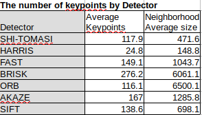
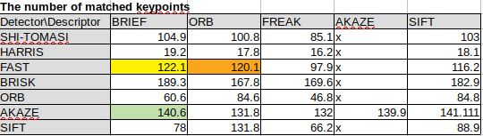
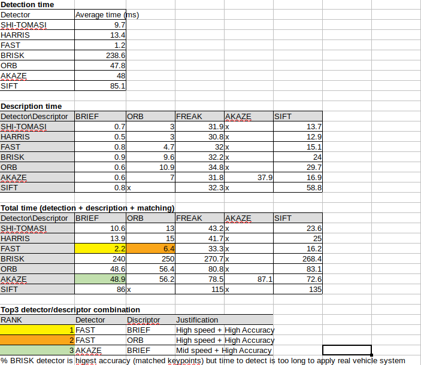

# SFND 2D Feature Tracking


The idea of the camera course is to build a collision detection system - that's the overall goal for the Final Project. As a preparation for this, you will now build the feature tracking part and test various detector / descriptor combinations to see which ones perform best. This mid-term project consists of four parts:

* First, you will focus on loading images, setting up data structures and putting everything into a ring buffer to optimize memory load. 
* Then, you will integrate several keypoint detectors such as HARRIS, FAST, BRISK and SIFT and compare them with regard to number of keypoints and speed. 
* In the next part, you will then focus on descriptor extraction and matching using brute force and also the FLANN approach we discussed in the previous lesson. 
* In the last part, once the code framework is complete, you will test the various algorithms in different combinations and compare them with regard to some performance measures. 

See the classroom instruction and code comments for more details on each of these parts. Once you are finished with this project, the keypoint matching part will be set up and you can proceed to the next lesson, where the focus is on integrating Lidar points and on object detection using deep-learning. 

## Dependencies for Running Locally
* cmake >= 2.8
  * All OSes: [click here for installation instructions](https://cmake.org/install/)
* make >= 4.1 (Linux, Mac), 3.81 (Windows)
  * Linux: make is installed by default on most Linux distros
  * Mac: [install Xcode command line tools to get make](https://developer.apple.com/xcode/features/)
  * Windows: [Click here for installation instructions](http://gnuwin32.sourceforge.net/packages/make.htm)
* OpenCV >= 4.1
  * This must be compiled from source using the `-D OPENCV_ENABLE_NONFREE=ON` cmake flag for testing the SIFT and SURF detectors.
  * The OpenCV 4.1.0 source code can be found [here](https://github.com/opencv/opencv/tree/4.1.0)
* gcc/g++ >= 5.4
  * Linux: gcc / g++ is installed by default on most Linux distros
  * Mac: same deal as make - [install Xcode command line tools](https://developer.apple.com/xcode/features/)
  * Windows: recommend using [MinGW](http://www.mingw.org/)

## Basic Build Instructions

1. Clone this repo.
2. Make a build directory in the top level directory: `mkdir build && cd build`
3. Compile: `cmake .. && make`
4. Run it: `./2D_feature_tracking`.

## Mid-Term Report
## MP.1 Data Buffer Optimization
Implement a vector for dataBuffer objects whose size does not exceed a limit (e.g. 2 elements). This can be achieved by pushing in new elements on one end and removing elements on the other end.
```
        if (dataBuffer.size() == dataBufferSize) { dataBuffer.erase(std::begin(dataBuffer)); }
        dataBuffer.push_back(frame);
```
## MP.2 Keypoint Detection
Implement detectors HARRIS, FAST, BRISK, ORB, AKAZE, and SIFT and make them selectable by setting a string accordingly.
```
void detKeypointsModern(vector<cv::KeyPoint> &keypoints, cv::Mat &img, std::string detectorType, bool bVis) {
    // select the descripotr
    cv::Ptr<cv::FeatureDetector> detector;
    if (detectorType.compare("BRISK") == 0) {
        int threshold = 30;        // FAST/AGAST detection threshold score.
        int octaves = 3;           // detection octaves (use 0 to do single scale)
        float patternScale = 1.0f; // apply this scale to the pattern used for sampling the neighbourhood of a keypoint.
        detector = cv::BRISK::create(threshold, octaves, patternScale);

    } else if (detectorType.compare("AKAZE") == 0) {
        detector = cv::AKAZE::create();

    } else if (detectorType.compare("ORB") == 0) {
        detector = cv::ORB::create();

    } else if (detectorType.compare("FAST") == 0) {
        int threshold = 30;// Difference between intensity of the central pixel and pixels of a circle around this pixel
        bool nonmaxSuppression = true;// perform non-maxima suppression on keypoints
        cv::FastFeatureDetector::DetectorType type = cv::FastFeatureDetector::TYPE_9_16;// TYPE_9_16, TYPE_7_12, TYPE_5_8
        detector = cv::FastFeatureDetector::create(threshold, nonmaxSuppression, type);
    } else if (detectorType.compare("SIFT") == 0) {
        detector = cv::xfeatures2d::SIFT::create();
    } else {
        throw invalid_argument(detectorType + " is not supported, FAST, BRISK, ORB, AKAZE, SIFT are valid detectorTypes");
    }

    // perform feature description
    detector->detect(img, keypoints);
    cout << "Detection with n=" << keypoints.size() << endl;
    if (bVis) {
        // Visualize the keypoints
        string windowName = detectorType + " keypoint detection results";
        cv::namedWindow(windowName);
        cv::Mat visImage = img.clone();
        cv::drawKeypoints(img, keypoints, visImage, cv::Scalar::all(-1), cv::DrawMatchesFlags::DRAW_RICH_KEYPOINTS);
        cv::imshow(windowName, visImage);
        cv::waitKey(0);
    }
}
```
## MP.3 Keypoint Removal
Remove all keypoints outside of a pre-defined rectangle and only use the keypoints within the rectangle for further processing.
```
        bool bFocusOnVehicle = true;
        cv::Rect vehicleRect(535, 180, 180, 150);
        vector<cv::KeyPoint> insidePoints;

        if (bFocusOnVehicle)
        {
            for (auto keypt:keypoints) {
                bool isinside = vehicleRect.contains(keypt.pt);
                if (isinside) {
                    insidePoints.push_back(keypt);
                    kpts_dia.push_back(keypt.size);
                }
            }
        keypoints = insidePoints;
        }
```
## MP.4 Keypoint Descriptors
Implement descriptors BRIEF, ORB, FREAK, AKAZE and SIFT and make them selectable by setting a string accordingly.
```
void descKeypoints(vector<cv::KeyPoint> &keypoints, cv::Mat &img, cv::Mat &descriptors, string descriptorType)
{
    // select appropriate descriptor
    cv::Ptr<cv::DescriptorExtractor> extractor;
    if (descriptorType.compare("BRISK") == 0)
    {
        int threshold = 30;        // FAST/AGAST detection threshold score.
        int octaves = 3;           // detection octaves (use 0 to do single scale)
        float patternScale = 1.0f; // apply this scale to the pattern used for sampling the neighbourhood of a keypoint.

        extractor = cv::BRISK::create(threshold, octaves, patternScale);
    } else if (descriptorType.compare("BRIEF")== 0) {
        int bytes = 32; // Legth of the descriptor in bytes, valid values are: 16, 32 (default) or 64 .
        bool use_orientation = false;// Sample patterns using keypoints orientation, disabled by default.
        extractor = cv::xfeatures2d::BriefDescriptorExtractor::create(bytes, use_orientation);
     
    } else if (descriptorType.compare("AKAZE") == 0) {
        auto descriptor_type = cv::AKAZE::DESCRIPTOR_MLDB;// Type of the extracted descriptor: DESCRIPTOR_KAZE, DESCRIPTOR_KAZE_UPRIGHT, DESCRIPTOR_MLDB or DESCRIPTOR_MLDB_UPRIGHT.
        int descriptor_size = 0;// Size of the descriptor in bits. 0 -> Full size
        int descriptor_channels = 3;// Number of channels in the descriptor (1, 2, 3)
        float threshold = 0.001f;// Detector response threshold to accept point
        int nOctaves = 4;// Maximum octave evolution of the image
        int nOctaveLayers = 4;// Default number of sublevels per scale level
        auto diffusivity = cv::KAZE::DIFF_PM_G2;// Diffusivity type. DIFF_PM_G1, DIFF_PM_G2, DIFF_WEICKERT or DIFF_CHARBONNIER

        extractor = cv::AKAZE::create(descriptor_type, descriptor_size, descriptor_channels, threshold, nOctaves, nOctaveLayers, diffusivity);

    } else if (descriptorType.compare("ORB") == 0) {
        int nfeatures = 500;// The maximum number of features to retain.
        float scaleFactor = 1.2f;// Pyramid decimation ratio, greater than 1.
        int nlevels = 8;// The number of pyramid levels.
        int edgeThreshold = 31;// This is size of the border where the features are not detected.
        int firstLevel = 0;// The level of pyramid to put source image to.
        int WTA_K = 2;// The number of points that produce each element of the oriented BRIEF descriptor.
        auto scoreType = cv::ORB::HARRIS_SCORE;// The default HARRIS_SCORE means that Harris algorithm is used to rank features.
        int patchSize = 31;// Size of the patch used by the oriented BRIEF descriptor.
        int fastThreshold = 20;// The fast threshold.
        extractor = cv::ORB::create(nfeatures, scaleFactor, nlevels, edgeThreshold, firstLevel, WTA_K, scoreType, patchSize, fastThreshold);
    } else if (descriptorType.compare("FREAK") == 0) {
        bool orientationNormalized = true;// Enable orientation normalization.
        bool scaleNormalized = true;// Enable scale normalization.
        float patternScale = 22.0f;// Scaling of the description pattern.
        int nOctaves = 4;// Number of octaves covered by the detected keypoints.
        const std::vector<int> &selectedPairs = std::vector<int>(); // (Optional) user defined selected pairs indexes,
        extractor = cv::xfeatures2d::FREAK::create(orientationNormalized, scaleNormalized, patternScale, nOctaves, selectedPairs);
    } else if (descriptorType.compare("SIFT") == 0) {
        int nfeatures = 0;// The number of best features to retain.
        int nOctaveLayers = 3;// The number of layers in each octave. 3 is the value used in D. Lowe paper.
        double contrastThreshold = 0.04;// The contrast threshold used to filter out weak features in semi-uniform (low-contrast) regions.
        double edgeThreshold = 10;// The threshold used to filter out edge-like features.
        double sigma = 1.6;// The sigma of the Gaussian applied to the input image at the octave \#0.
        extractor = cv::xfeatures2d::SIFT::create(nfeatures, nOctaveLayers, contrastThreshold, edgeThreshold, sigma);
    } else {
        throw invalid_argument(descriptorType + 
        " is not supported, Only BRIEF, ORB, FREAK, AKAZE and SIFT is allowed as input dor descriptor");        
    extractor->compute(img, keypoints, descriptors);
    }
```
## MP.5 Descriptor Matching
Implement FLANN matching as well as k-nearest neighbor selection. Both methods must be selectable using the respective strings in the main function.
```
void matchDescriptors(std::vector<cv::KeyPoint> &kPtsSource, std::vector<cv::KeyPoint> &kPtsRef, cv::Mat &descSource, cv::Mat &descRef,
                      std::vector<cv::DMatch> &matches, std::string descriptorclass, std::string matcherType, std::string selectorType)
{
    // configure matcher
    bool crossCheck = false;
    cv::Ptr<cv::DescriptorMatcher> matcher;
    int normType;

    if (matcherType.compare("MAT_BF") == 0)
    {
        int normType = descriptorclass.compare("DES_BINARY") == 0 ? cv::NORM_HAMMING : cv::NORM_L2 ;
        matcher = cv::BFMatcher::create(normType, crossCheck);
    }
    else if (matcherType.compare("MAT_FLANN") == 0)
    {
        // OpenCV bug workaround : convert binary descriptors to floating point due to a bug in current OpenCV implementation
        if (descSource.type() !=CV_32F) {
            descSource.convertTo(descSource, CV_32F);
            // descRef.convertTo(descRef, CV_32F);
        }
        if (descRef.type() !=CV_32F) {
            descRef.convertTo(descRef, CV_32F);
        }
        matcher = cv::DescriptorMatcher::create(cv::DescriptorMatcher::FLANNBASED);
    }
    else
    {
        throw invalid_argument(matcherType + " is not supported, only MAT_FLANN and MAT_BF is valid matchertype ");
    }
```

## MP.6 Descriptor Distance Ratio
Use the K-Nearest-Neighbor matching to implement the descriptor distance ratio test, which looks at the ratio of best vs. second-best match to decide whether to keep an associated pair of keypoints.
```
    // perform matching task
    if (selectorType.compare("SEL_NN") == 0)
    { // nearest neighbor (best match)

        matcher->match(descSource, descRef, matches); // Finds the best match for each descriptor in desc1
        cout <<  "Descriptorclass : " << descriptorclass << " (NN) with n = " << matches.size() << endl;
    }
    else if (selectorType.compare("SEL_KNN") == 0)
    { // k nearest neighbors (k=2)
        vector<vector<cv::DMatch>> knn_matches;
        matcher->knnMatch(descSource, descRef, knn_matches, 2);
        //-- Filter matches using the Lowe's ratio test
        double minDescDistRatio = 0.8;
        for (auto it = knn_matches.begin(); it != knn_matches.end(); ++it) {
            if ((*it)[0].distance < minDescDistRatio * (*it)[1].distance) {
                matches.push_back((*it)[0]);
            }
        }
        cout << "Descriptorclass: " << descriptorclass << " (KNN) with n=" << knn_matches.size()
             << "# keypoints removed = "
             << knn_matches.size() - matches.size() << endl;
    }
    else
    {
        throw invalid_argument(
                selectorType + " is not supported, only SEL_NN and SEL_KNN  is valid selectorType for matcher ");
    }
}
```

## MP.7 Performance Evaluation 1
Count the number of keypoints on the preceding vehicle for all 10 images and take note of the distribution of their neighborhood size. Do this for all the detectors you have implemented.
<br>


## MP.8 Performance Evaluation 2
Count the number of matched keypoints for all 10 images using all possible combinations of detectors and descriptors. In the matching step, the BF approach is used with the descriptor distance ratio set to 0.8.
<br>

## MP.9 Performance Evaluation 3
Log the time it takes for keypoint detection and descriptor extraction. The results must be entered into a spreadsheet and based on this data, the TOP3 detector / descriptorombinations must be recommended as the best choice for our purpose of detecting keypoints on vehicles.
<br>



 
